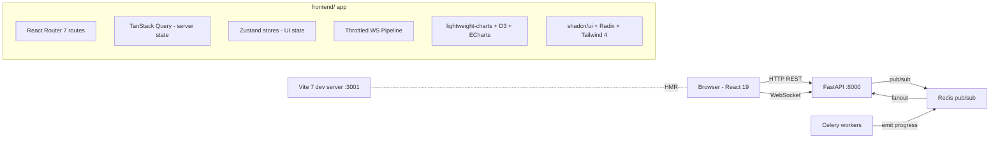
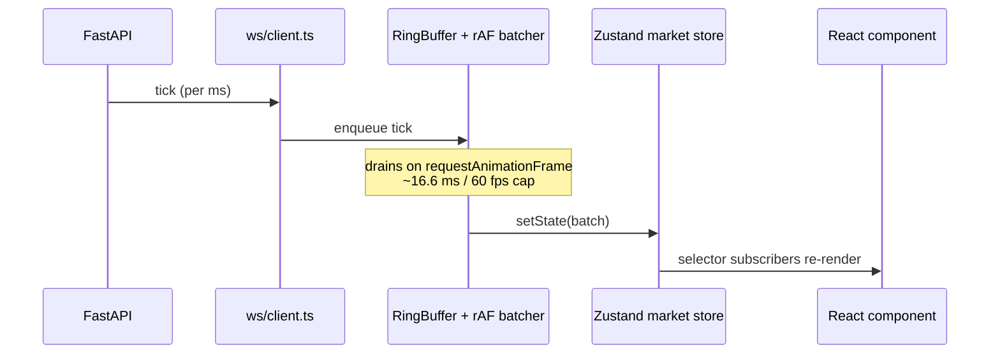

# AQP Frontend Rewrite: Vite + Tailwind + shadcn

## Scope decision

- **Full rewrite** to Vite 7 + React 19 + TS 5.9 + Tailwind CSS 4 + shadcn/ui per blueprint Directives 1-5.
- **Priority surface**: Live Trading + Action Center (kill-switch, sandbox banner, lightweight-charts WebGL OHLC, throttled WS, semi-auto approval modal).
- New app lives at `agentic_quant_platform/frontend/`. The existing [webui/](webui/) (Next.js + Antd, 127 routes) stays operational on `:3000` during migration; the new app starts on `:3001` and takes `:3000` only after parity.
- Backend FastAPI is **untouched**. WS payload contract `{task_id, stage, message, timestamp, **extras}` from [aqp/tasks/_progress.py](aqp/tasks/_progress.py) is preserved (AGENTS.md hard rule).
- Existing `webui/lib/api/generated/schema.d.ts` (openapi-typescript output) is reused; no backend regen needed.

## Target architecture



## WebSocket throttling pipeline (priority directive)

The blueprint mandates batching microsecond ticks down to ~30 FPS so React's reconciler is never overwhelmed. The current [webui/lib/ws/useLiveStream.ts](webui/lib/ws/useLiveStream.ts) writes every message straight to state - this is the bug.



Implementation in `frontend/src/lib/ws/throttle.ts`:

```typescript
export function createRafBatcher<T>(flush: (batch: T[]) => void, fpsCap = 30) {
  const minIntervalMs = 1000 / fpsCap;
  let queue: T[] = [];
  let lastFlush = 0;
  let rafHandle: number | null = null;
  return (msg: T) => {
    queue.push(msg);
    if (rafHandle != null) return;
    rafHandle = requestAnimationFrame((now) => {
      rafHandle = null;
      if (now - lastFlush < minIntervalMs) return;
      const batch = queue; queue = []; lastFlush = now;
      flush(batch);
    });
  };
}
```

## Phase 0 - Scaffolding and design system

### 0.1 Vite + TS + Tailwind 4 + shadcn

Create `frontend/` with the blueprint stack:

- `pnpm create vite frontend --template react-ts`
- Install Tailwind CSS 4 (`@tailwindcss/vite` plugin), shadcn-ui CLI primitives, Radix UI, Biome (linter/formatter), Vitest, Playwright.
- Vite config proxies `/api/*` -> `http://localhost:8000` and `/ws/*` -> `ws://localhost:8000` so cookies and WebSockets stay same-origin.
- TypeScript: `strict: true`, `noUncheckedIndexedAccess: true`, `exactOptionalPropertyTypes: true`.

### 0.2 Design tokens (semantic, not branding)

`frontend/src/styles/tokens.css` and `tailwind.config.ts`:

- Backgrounds: `--bg-app: #0F172A`, `--bg-surface: #1E293B`, `--bg-elevated: #243042`.
- Text: `--text-primary: #E5E7EB`, `--text-secondary: #94A3B8`, tabular figures via `font-feature-settings: "tnum" 1`.
- Semantic financial: `--pos-fg: #10B981`, `--neg-fg: #EF4444`, `--warn-fg: #F59E0B`, `--info-fg: #3B82F6`. Reserved exclusively for financial state - never branding.
- Sandbox mode: `--sandbox-border: #F59E0B` applied to global `<body>` outline + topbar bottom border when `mode === "sandbox"`.
- Light mode is secondary; dark is default per blueprint.

### 0.3 Reusable primitives

Wired in `frontend/src/components/ui/`:

- `Numeric.tsx` - tabular-num formatter that picks `pos`/`neg`/`neutral` color from sign and respects locale.
- `ConfirmFrictionDialog.tsx` - shadcn AlertDialog wrapper that renders an explicit consequence summary, requires typed confirmation for irreversible actions, and disables submit until the user has scrolled through risk text.
- `KillSwitch.tsx` - prominent red button in TopBar that POSTs to `/agents/halt`, `/paper/stop-all`, `/bots/halt-all` in parallel.
- `SandboxBanner.tsx` - global amber border + label whenever active project is in `sandbox` or `paper` mode (read from `useTenancyStore`).

### 0.4 State management

Mirror existing patterns:

- `frontend/src/store/ui.ts` - Zustand: theme, sidebar, command palette, sandbox-mode flag.
- `frontend/src/store/tenancy.ts` - port directly from [webui/lib/store/tenancy.ts](webui/lib/store/tenancy.ts); inject `X-AQP-User`, `X-AQP-Workspace`, `X-AQP-Project`, `X-AQP-Lab` headers.
- `frontend/src/store/market.ts` - new Zustand slice with selector-based subscriptions: `latestBySymbol`, `lastTickTimestamp`. Updates only via the rAF batcher.
- `frontend/src/lib/api/client.ts` - port [webui/lib/api/client.ts](webui/lib/api/client.ts) (openapi-fetch + tenancy middleware + ApiError).
- TanStack Query config: `staleTime: 30_000`, `retry: 1`, exponential backoff, `refetchOnWindowFocus: false`.

### 0.5 Routing and shell

- React Router 7 (data routers) since Vite has no Next.js file routing.
- `frontend/src/routes.tsx` - declarative route tree mirroring [webui/components/shell/nav-config.tsx](webui/components/shell/nav-config.tsx).
- Shell components: `Sidebar`, `TopBar`, `CommandK`, `WorkspaceSwitcher`, `AssistantDrawer`, `KillSwitch`, `SandboxBanner` - rebuilt on shadcn/Radix instead of Antd Layout.

## Phase 1 - Live Trading + Action Center (priority)

This phase delivers the blueprint's mandated outcome before any other route porting.

### 1.1 Throttled WS layer

`frontend/src/lib/ws/`:

- `client.ts` - WebSocket factory with reconnect + exponential backoff (port from [webui/lib/ws/useWebSocket.ts](webui/lib/ws/useWebSocket.ts)).
- `throttle.ts` - rAF batcher (snippet above), 30 FPS cap configurable per stream.
- `useLiveStream.ts` - **rewritten** to push through the batcher. Bounded ring buffer (default 1024) replaces unbounded `concat`. Selectors subscribe to `latest[symbol]` only.
- `useChatStream.ts` - port from [webui/lib/ws/useChatStream.ts](webui/lib/ws/useChatStream.ts) preserving `{stage, message, agent, tool, delta, content, ts}` payload shape.

### 1.2 lightweight-charts WebGL OHLC

`frontend/src/components/charts/OhlcChart.tsx`:

- Replaces the Recharts approximation in [webui/components/charts/OHLC.tsx](webui/components/charts/OHLC.tsx) with a real candlestick canvas via `lightweight-charts` v4.
- Memoized series; pushes batched ticks from `useLiveStream` directly into `series.update()` (canvas redraw, no React reconciliation).
- Volume histogram in a sub-pane; semantic `--pos-fg` / `--neg-fg` colors; tabular numerics on price scale.

### 1.3 Live Trading Desk route (`/live`)

`frontend/src/routes/live/`:

- `page.tsx` - resizable split-pane (Radix `Resizable`): left = OHLC + order book, right = open positions + working orders.
- `OrderBook.tsx` - virtualized rows via `@tanstack/react-virtual`; selector subscriptions per row to avoid full-table re-renders on tick.
- `OrderTicket.tsx` - form bound to `apiFetch("/orders", { method: "POST" })` wrapped in `ConfirmFrictionDialog`.
- `KillSwitch` rendered in TopBar; halts agents + paper + bots in one click.

### 1.4 Action Center (semi-auto agent approval)

`frontend/src/components/action-center/`:

- Subscribes to `/agents/proposals/stream` WS (existing endpoint via `AgentRuntime`).
- Each proposal pushes a high-priority toast that opens a `ConfirmFrictionDialog` with: trade specifics, risk metrics, the agent's LTL guardrail decisions, the cost-cap remaining, and a typed-confirmation gate.
- Approval POSTs to `/agents/proposals/{id}/approve`; rejection to `/decline`. Both routes go through `AgentRuntime` so `agent_runs_v2` rows update (per AGENTS.md rule 12).
- Pending queue surfaces as a Topbar badge with count.

### 1.5 Sandbox / Paper mode global indicator

- `SandboxBanner` reads `useTenancyStore().mode` (`live | paper | sandbox`).
- When non-live: applies amber border around `<main>`, prefixes browser tab title with `[SANDBOX]`, and adds a persistent topbar strip.
- Order ticket and Action Center buttons gain a "Simulated execution" caption when sandbox is active.

### 1.6 Tests

- Vitest unit: `throttle.test.ts` validates ~30 FPS cap with synthetic 1 kHz tick stream.
- Playwright E2E: `live-action-center.spec.ts` simulates a proposed trade WS event, validates modal appears, typed confirmation gates the approve button, kill-switch halts agents.

## Phase 2-6 - Route porting (sequenced after live trading lands)

### Phase 2 - Core surfaces (~25 routes)
Dashboard, Bots (list/new/[id]/runs), Agents (home/registry/runs/[id]/evaluations/research/selection/trader/analysis/templates), RL (lab/zoo/runs/[id]/replay), ML (training/builder/datasets/test/models/zoo), Backtest (list/new/[id]/lab), Paper, Portfolio, Monitor, Crew Trace, Chat.

### Phase 3 - Research surfaces (~50 routes)
Strategies, Data Hub, Data Catalog, Iceberg Editor, dbt Models, Data Ingest, Pipelines, Pipelines Hub, Sinks, Project Datasets, Dataset Library, Microstructure, Airbyte (4 pages), Data Workspace, Visualizations, Entity Graph, Service Manager, Data Browser, Sources (+ wizards), CFPB / FDA / USPTO, Indicator Catalog, Alpha Vantage, Live Market, Factor Workbench, Feature Sets, Knowledge Graph, Equity Research, Learn / Taxonomy, RAG Explorer, RAG Admin, Streaming (Kafka/Flink/Producers).

### Phase 4 - Workflow editors (~6 routes)
Agent Crew Editor, Strategy Composer, Data Pipeline Editor, ML Builder canvas, RL Lab canvas, Bot Builder canvas. All use `xyflow/React Flow` (already in deps); palettes ported from existing `webui/components/{rl,bots,ml}/palette.ts`.

### Phase 5 - Admin / Tenancy (~10 routes)
Resource Explorer, Orgs, Teams, Users, Workspaces, Projects, Labs, Layered Config, Models & Providers, Settings.

### Phase 6 - Specialty (~10 routes)
Options Lab, Monte Carlo, Optimizer, Docs viewer.

### Cutover

- Update [docker-compose.yml](docker-compose.yml) to add `frontend` service on `:3001` (rename existing `webui` to `webui-legacy` and shift to `:3010` until removal).
- Once parity reached, swap port mappings: new `frontend` -> `:3000`, archive `webui/` to `webui-legacy/`.
- Update [README.md](README.md) and [AGENTS.md](AGENTS.md) "Where things live" to point at `frontend/`.

## Stack reference

- **Build**: Vite 7, TypeScript 5.9 strict, Biome 1.x.
- **UI**: Tailwind CSS 4, shadcn/ui, Radix UI primitives, Lucide icons.
- **State**: TanStack Query 5 (server), Zustand 5 (client), Immer (where helpful).
- **Routing**: React Router 7 data routers.
- **Charts**: `lightweight-charts` 4 (WebGL OHLC), D3 7 (ML/loss curves, feature importance, custom plots), ECharts 5 (3D vol surfaces, sankeys), Recharts (general).
- **Tables**: AG Grid Community 32 (already in existing deps).
- **Editor**: CodeMirror 6 (per blueprint, replacing Monaco).
- **Flow**: `@xyflow/react` 12 (already in deps).
- **API**: `openapi-fetch` + reuse existing `webui/lib/api/generated/schema.d.ts`.
- **Forms**: react-hook-form + zod.
- **Testing**: Vitest, Testing Library, Playwright.

## Risk notes

- React Router 7 data routers replace Next.js `app/` conventions; the route tree must be hand-built. Mitigated by mirroring [webui/components/shell/nav-config.tsx](webui/components/shell/nav-config.tsx).
- shadcn/ui is copy-into-source so each component is a small file the Cursor agent owns - no opaque package upgrades, but bumps are manual.
- 127 routes is multi-week. Phases 2-6 are tracked but not implemented in this initial plan execution; only Phase 0 + Phase 1 produce running code in the first delivery.
- The existing webui keeps shipping until parity. No deletes of `webui/` files in this plan.
- WS payload shape `{task_id, stage, message, timestamp, **extras}` is preserved (AGENTS.md rule 4). The throttle layer batches but never renames keys.