# Exhaustive AQP Rehydration from 7 Inspiration Sources

## Scope

- **150+ assets** rehydrated across 7 sources: `stock-analysis-engine`, `analyzingalpha`, `notebooks-master`, `akquant-main/examples`, `QTradeX-AI-Agents`, `hftbacktest/examples`, `Stock-Prediction-Models`.
- **Framework enhancements** added FIRST so extractions can be wired without ad-hoc shims.
- **Reference cache** at `extractions/` keeps extracted snippets + AQP mapping notes — used instead of re-reading inspiration during follow-ups.
- **HFT/LOB engine** stays a stub + future-work prompt (option B); we extract the analytics today.
- **3 random end-to-end tests** (strategy backtest, ML training, agent run) selected and listed.

## Data flow

```mermaid
flowchart TB
    INSP[inspiration/*]
    CACHE[extractions/&lt;source&gt;/*.md]
    FW[Framework enhancements]
    REG[Strategies / ML models / RL agents / Indicators / Tools registries]
    YAML[configs/&#123;strategies,ml,rl,agents,datasets&#125;/*.yaml]
    PIPE[aqp/data/pipelines + Celery tasks]
    ICEBERG[Iceberg dataset presets]
    UI[webui browsers + wizards + detail pages]
    API[aqp/api/routes]
    TEST[tests/* incl. 3 random end-to-end]

    INSP --> CACHE
    CACHE --> FW
    FW --> REG
    REG --> YAML
    PIPE --> ICEBERG
    REG --> API
    YAML --> API
    API --> UI
    REG --> TEST
    YAML --> TEST
    PIPE --> TEST
```

## Phase 0 — Reference cache layout

Create `extractions/` at repo root with:

- `extractions/INDEX.md` — top-level table of contents linking every per-source `REFERENCE.md`.
- `extractions/_KNOWN_ISSUES.md` — captures things we deliberately did not fix (cost / risk).
- `extractions/_FUTURE_PROMPTS/lob_adapter_prompt.md` — itemized markdown prompt for a future Cursor run that does the deep hftbacktest LOB adapter (see Phase 1.B note below).
- One folder per source: `extractions/{stock_analysis_engine, analyzingalpha, notebooks, akquant, qtradex, hftbacktest, stock_prediction_models}/REFERENCE.md` plus per-asset `<asset>.md` files containing: source location, key code excerpt, AQP mapping (target file/registry/YAML), dependencies, refactor notes, gotchas.

These per-asset markdown files become the canonical reference for any subsequent work — we read these instead of the raw inspiration code.

## Phase 1 — Framework enhancements (added FIRST)

These are the missing primitives every later extraction relies on. Each is a small, well-scoped module.

### 1.A New modules (most are net-new files)

- `aqp/data/microstructure.py` — `order_book_imbalance`, `microprice`, `depth_slope`, `weighted_spread`, `vpin`, `trade_flow_imbalance`. Pure Polars/NumPy. Pulls naming conventions from `examples/Market Making with Alpha - Order Book Imbalance.ipynb` and `py-hftbacktest/hftbacktest/binding.py` event schema.
- `aqp/data/realised_volatility.py` — Close-to-close, Parkinson, Garman-Klass, Rogers-Satchell, Yang-Zhang OHLC vol estimators. From `notebooks-master/realised_volatility.ipynb`.
- `aqp/data/cointegration.py` — `adf_test`, `engle_granger`, `kalman_hedge_ratio`. Wraps `statsmodels` per `notebooks-master/commodity_crack_spread_stat_arb.ipynb`.
- `aqp/data/regime.py` — `RegimeClassifier` (ADX trend-vs-range), `MultiMASlopeVote` (from `qtradex/ma_sabres.py`), `BlackHoleZone` (compression/surge from `qtradex/blackhole.py`).
- `aqp/data/labels.py` — `next_bar_binary`, `n_step_return`, `triple_barrier` (delegates to existing if present), `zigzag_anchored`, `fractional_diff`. Pulls from `Stock-Prediction-Models` and `analyzingalpha`.
- `aqp/data/factor_expression.py` — Tiny Polars-based DSL covering `Ts_Mean / Ts_Std / Ts_Corr / Rank / Decay_Linear / Delta` (Alpha101 idioms) inspired by `akquant-main/examples/19_factor_expression.py`. Used by the alpha screener tool.
- `aqp/data/spread_models.py` — Crush, crack, calendar spread builders. From `notebooks-master/commodity_*_spread_stat_arb.ipynb`.
- `aqp/data/patterns.py` — Swing extrema + chart pattern matchers (head-and-shoulders, double top/bottom). Ports `analyzingalpha/2020-04-18-algorithmic-chart-pattern-detection/extrema.py` + `pattern-recognition.py`.
- `aqp/options/__init__.py` (new package), `aqp/options/normal_model.py` — Bachelier price + Greeks (delta, gamma, theta, vega, vanna, volga, veta) from `notebooks-master/Greeks_under_normal_model.ipynb`.
- `aqp/options/inverse_options.py` — Deribit-style inverse option PV/Greeks/IV-surface helpers from `notebooks-master/inverse_option.ipynb`.
- `aqp/options/spreads.py` — Vertical spread max profit/loss/mid from `stock-analysis-engine/build_option_spread_details.py`.
- `aqp/strategies/portfolio_construction.py` — `TargetWeightsRebalancer`, `MomentumRotation`, `SixtyForty`, `BasicRiskParity`, `BasicHRP` (uses `scipy.cluster.hierarchy.linkage`).
- `aqp/strategies/lob.py` — `LobStrategy` ABC stub: `on_event(state) -> list[OrderIntent]`, `on_book_update(...)`, `on_trade(...)`. **Engine deferred** — see `extractions/_FUTURE_PROMPTS/lob_adapter_prompt.md`.
- `aqp/backtest/hft_metrics.py` — Sample-aware Sharpe/Sortino, max-position, mean leverage, return-over-trade, fill ratio. Ports `py-hftbacktest/hftbacktest/stats/metrics.py` to plain pandas/Polars.
- `aqp/ml/walk_forward.py` — `WalkForwardSplitter` + `WalkForwardTrainer` mirroring `akquant.ml` adapter ergonomics; consumes existing `Model` / `DatasetH`. Used by all SPM forecaster wrappers.
- `aqp/ml/models/spm/_torch_base.py` — Common `TorchForecasterBase(Model)` (Lightning-free PyTorch loop) so SPM ports stay terse.

### 1.B Extensions to existing files

- `aqp/core/indicators.py::ALL_INDICATORS` — append: `KST`, `RAVI`, `FRAMA`, `Vortex`, `Fisher`, `AroonOsc`, `MFI`, `UlcerIndex`, `Trix`, `Coppock`, `MassIndex`, `MesaSineWave`, `Renko`, `ZigZag`, `AnchoredVWAP`, `OFI`, `Microprice`, `DepthSlope`. Each is a thin `IndicatorBase` subclass delegating to the new modules above.
- `aqp/data/indicators_zoo.py::IndicatorZoo._default_specs` — extend default to include 4 of the new ones.
- `aqp/strategies/risk_models.py` — add `VolTargetingRiskModel` (from Moskowitz/Baltas trend) and `MaxNotionalPerSymbolRiskModel` (from `examples/example.py`).
- `aqp/agents/tools/__init__.py::TOOL_REGISTRY` — register the new tools listed in Phase 8.
- `aqp/persistence/models.py::Strategy` (and analogous `MLModel`, `AgentSpecRow`, `Dataset`) — add columns `source_repo: str | None`, `source_path: str | None`, `category: str | None`, `extracted_at: datetime | None`. New Alembic migration `0016_extraction_metadata.py`.
- `aqp/core/registry.py` — extend `@register` to also accept `source=` and `category=` kwargs, surfaced in `list_by_kind`.

## Phase 2 — Strategy extractions (~55)

Per source, group as `aqp/strategies/<source>/<name>.py`. Each gets `@register("Name", source="...", category="...")` and a YAML in `configs/strategies/<source>/<name>.yaml`.

### 2.A `aqp/strategies/qtradex/` (28)

All 28 QTradeX bots ported as `IAlphaModel` (or `IStrategy` for those with custom execution) — replacing `qx.ti.*` / `qx.qi.*` calls with the AQP indicator zoo and the new `aqp/data/microstructure.py` / `aqp/data/regime.py` helpers. The 28: `Aroon`, `AroonMfiVwap`, `BlackHoleStrategy`, `ClassicalCryptoBot`, `Confluence`, `CryptoMasterBot`, `Cthulhu`, `DirectionalMovement`, `EmaCross` (sma-envelope variant), `ExtinctionEvent`, `Forty96`, `UltimateForecastMesa`, `FRAMABot`, `ParabolicSARBot` (one canonical, deduplicating `harmonica.py` vs `parabolic_ten.py`), `EmaCrossHA`, `IchimokuBot`, `IChing`, `KSTIndicatorBot`, `LavaHK`, `MASabres`, `BBadXMacDrSi`, `MasterBot`, `Renko`, `HeikinAshiIchimokuVortexBot`, `TradFiInspired`, `TrimaZlemaFisher`, `VortexIndicatorBot`. Discrete-policy tunes (`tunes/forty96_4099.json`, `tunes/iching_70.json`) ship under `configs/strategies/qtradex/_tunes/` and are referenced from the YAML.

### 2.B `aqp/strategies/notebooks/` (16)

`MoskowitzTSMOM`, `BaltasTrend`, `BreakoutTrend`, `FXCarry`, `CommodityTermStructure`, `CommodityMomentum`, `CommoditySkewness`, `CommodityIntraCurve`, `CrushSpreadStatArb`, `CrackSpreadStatArb`, `CommodityBasisMomentum`, `CommodityBasisReversal`, `ChineseFuturesTrend`, `CrossAssetSkewness`, `OvernightReturns`, `ConnorsShortTerm` (4 rule variants), `GaoIntradayMomentum`. Vivace dependencies replaced with our Iceberg bar loader + `aqp/data/realised_volatility.py` + `aqp/data/cointegration.py`.

### 2.C `aqp/strategies/akquant/` (12)

`DualMovingAverage`, `GridTrading`, `AtrBreakout`, `MomentumRotation`, `BucketMomentumRotation`, `TimerMomentumRotation`, `TPlusOne`, `FuturesTrend`, `CoveredCall`, `ETFGrid`, `SixtyFortyRebalance`, `TargetWeightsRebalance`. The functional `on_bar` demos ride on `FrameworkAlgorithm`.

### 2.D `aqp/strategies/analyzingalpha/` (8)

`SectorMomentum`, `SectorRSI`, `EquitiesStopLoss`, `EquitiesBracket`, `CryptoPriceShearMR`, `StatArbPairs`, `UnemploymentMacroOverlay` (FRED-driven), `ConnorsRSI` (companion). Note the upstream uses Backtrader; we re-implement signal math against AQP's bar interface — Backtrader is not added as a dependency.

### 2.E `aqp/strategies/sae/` (3)

`StockAnalysisEngineAdapter` (wraps `BaseAlgo.handle_data`/`process` semantics), `IndicatorVoteStrategy` (port of `trade_off_indicator_buy_and_sell_signals`), `OptionSpreadStrategy` (port of `build_option_spread_details`).

### 2.F `aqp/strategies/hft/` (5 stubs)

`GLFTMM`, `GridMM`, `ImbalanceAlphaMM`, `BasisAlphaMM`, `QueueAwareMM` — all subclass the new `LobStrategy` ABC. They contain the signal math but raise `NotImplementedError` from the engine integration point until the future LOB adapter ships. UI lists them as "Engine pending".

## Phase 3 — ML model extractions (~22)

`aqp/ml/models/spm/` (Stock-Prediction-Models, ported from TF1 to PyTorch via the new `_torch_base.py`):

- Forecasters: `LSTMForecaster`, `BidirectionalLSTM`, `LSTMAttention`, `StackedLSTM`, `GRUForecaster`, `BidirectionalGRU`, `VanillaRNN`, `LSTMGRUHybrid`, `TCNForecaster`, `Conv1DForecaster`, `TransformerForecaster`, `AttentionOnlyForecaster`, `BERTForecaster` (small distilled config so it actually trains on CPU).
- Classical: `ARIMAForecaster`, `ProphetForecaster`, `GARCHForecaster` (uses `arch`).
- Bayesian: `BayesianRidgeForecaster`, `MonteCarloDropoutForecaster`.

`aqp/ml/models/notebooks/`:

- `RidgeVoCForecaster` — Kelly et al. "virtue of complexity" Ridge-on-random-features from `notebooks-master/the_virtue_of_complexity_everywhere.ipynb`.
- `LogisticWalkForwardClassifier` — from `akquant-main/examples/10_ml_walk_forward.py`.

`aqp/ml/models/sae/`:

- `KerasMLPRegressor` — modernized port of `analysis_engine/ai/build_regression_dnn.py` to PyTorch (no Keras dependency).

Each gets a YAML training recipe in `configs/ml/<source>/<name>.yaml` referencing one of the new dataset presets (Phase 6).

## Phase 4 — RL agent extractions (~10)

`aqp/rl/agents/spm/` — port the SPM "deep-learning agents" with a thin `BaseRLAgent` wrapper that the existing `train_from_config` knows how to dispatch:

- `DQNAgent`, `DoubleDQNAgent`, `DuelingDQNAgent`, `DoubleDuelingDQNAgent`, `RecurrentDQNAgent`, `PolicyGradientAgent`, `ActorCriticAgent`, `A3CAgent`, `EvolutionStrategyAgent`, `ActorCriticExperienceReplayAgent`. PPO is left to the existing SB3 path.

Each gets a YAML in `configs/rl/spm/<name>.yaml` using the existing `StockTradingEnv` / `PortfolioAllocationEnv`.

## Phase 5 — Dataset builders + presets (~10)

Append to `aqp/data/labels.py` (Phase 1), then add `aqp/data/dataset_presets.py` exposing curated dataset definitions consumed by the UI:

- `intraday_momentum_etf` (Gao 2018 ETF panel: SPY/QQQ/IWM/DIA/etc., 30min bars).
- `commodity_futures_panel` (Hollstein 2020-style continuous futures returns).
- `china_a_shares_top200` (akshare-driven, mirrors akquant examples).
- `crypto_majors_intraday` (KuCoin BTC/ETH/SOL/XRP/etc., 5min — for QTradeX strategies).
- `equity_universe_sp500_daily` (yfinance-driven default).
- `fred_macro_basket` (FRED unemployment, CPI, PMI etc. — for the UnemploymentMacroOverlay).
- `eod_options_chain_sample` (small SPY chain snapshot for options demos).
- `lob_btcusdt_sample` (small Binance Futures depth sample for hftbacktest stubs — gz file from `examples/usdm/btcusdt_*`).

Each preset gets a Celery task in Phase 9.

## Phase 6 — Portfolio & analysis methods (~10)

Already covered by Phase 1 modules (`portfolio_construction.py`, `cointegration.py`, `regime.py`, `realised_volatility.py`, `options/*`, `spread_models.py`, `patterns.py`). Each is exported via `aqp/strategies/__init__.py` and registered with a tag for UI surfacing.

## Phase 7 — Tools and Agents (~14)

### 7.A New tools in `aqp/agents/tools/`

- `cointegration_tool.py` (runs ADF + Engle-Granger on a pair).
- `regime_classifier_tool.py` (ADX trend-vs-range from `aqp/data/regime.py`).
- `realised_vol_tool.py` (5 OHLC estimators).
- `factor_screen_tool.py` (Polars factor expression DSL).
- `hft_metrics_tool.py` (HFT-aware metrics on a backtest run).
- `multi_indicator_vote_tool.py` (TradFiInspired-style consensus).
- `chart_pattern_tool.py` (extrema + pattern recognition).
- `option_greeks_tool.py` (Bachelier + inverse Greeks).
- `option_spread_tool.py` (vertical spread P&L from `aqp/options/spreads.py`).

All registered in `aqp/agents/tools/__init__.py::TOOL_REGISTRY`.

### 7.B New `configs/agents/*.yaml` (research / selection / analysis personas)

- `research.regime_analyst.yaml` — uses `regime_classifier_tool` + `historical_volatility`.
- `research.composite_voter.yaml` — uses `multi_indicator_vote_tool` (TradFi/MASabres-style).
- `research.basis_momentum_analyst.yaml` — for commodity basis strategies.
- `research.cointegration_analyst.yaml` — for pairs/spreads.
- `research.intraday_momentum_analyst.yaml` — Gao 2018 narrative.
- `selection.cross_asset_skew_screener.yaml` — uses `factor_screen_tool`.
- `analysis.queue_position_analyst.yaml` — explains hftbacktest queue model outputs (consumes `hft_metrics_tool`).
- `analysis.cointegration_basket_finder.yaml` — for stat-arb basket discovery.
- `research.options_greeks_explainer.yaml` — uses `option_greeks_tool`.

### 7.C Wire LangGraph nodes

Extend `aqp/agents/graph/builder.py` with one new builder `build_quant_research_pipeline_graph` chaining `composite_voter` → `regime_analyst` → `cointegration_analyst` → existing `risk_simulator_approves` conditional.

## Phase 8 — Pipelines and ingestion

New ingestion pipelines under `aqp/data/pipelines/`:

- `akshare_china_panel.py` — China A-shares via `akshare` → `aqp_china.daily_bars` Iceberg table.
- `crypto_kucoin_intraday.py` — KuCoin via `python-kucoin` → `aqp_crypto.intraday_bars` (powers QTradeX strategies).
- `etf_intraday_panel.py` — yfinance 30-min bars → `aqp_etf.intraday_30min`.
- `commodity_futures_panel.py` — Continuous futures returns from FRED + provided sample CSV → `aqp_commodity.futures_panel`.
- `finviz_screener.py` — Snapshot Finviz screener pages → `aqp_screens.finviz_snapshots` (port of `stock-analysis-engine/finviz/fetch_api.py`).
- `lob_sample_loader.py` — load gz LOB samples from inspiration into `aqp_lob.btcusdt_samples`.

New Celery tasks (`aqp/tasks/dataset_preset_tasks.py`) wrap each pipeline with `emit/emit_done/emit_error`. Routed to the `ingestion` queue. Beat schedule additions kept conservative (only the FRED macro basket on a daily schedule).

API: `aqp/api/routes/dataset_presets.py` — `GET /dataset-presets`, `POST /dataset-presets/{name}/ingest`. Registered in `aqp/api/main.py`.

## Phase 9 — UI surfaces

All routes under `webui/app/(shell)/`. Each list page reuses `PageContainer` + `DataGrid` (or Ant `Table` where richer filtering is needed).

- **Strategies**: extend `webui/components/strategies/StrategiesBrowser.tsx` with `source` and `category` facet filters. Add a "From inspiration" badge driven by the new ORM columns.
- **`/ml/zoo`** (new) — browseable catalog of extracted ML architectures with metadata cards (source, training cost estimate, dataset preset). Detail page shows the YAML and links to "Train from this template".
- **`/rl/zoo`** (new) — same pattern for RL agents.
- **`/data/indicators`** (existing) — auto-picks up new entries; add preview cells for `Renko`, `Microprice`, `OBI`, `ZigZag`, `AnchoredVWAP`.
- **`/agents/templates`** (new) — agent-spec template browser; "Use this template" launches the existing `AgentBacktestWizard` flow with the spec preselected.
- **`/data/datasets/library`** (new) — curated dataset preset cards with one-click ingestion buttons hitting `/dataset-presets/{name}/ingest`.
- **`/data/microstructure`** (new) — LOB feature explorer: select a sample and visualize OBI, microprice, depth slope. Engine-pending strategies (Phase 2.F) are listed here with a banner pointing to the future-work prompt.
- **`/options/lab`** (new) — small Greeks calculator using `option_greeks_tool`.
- **`BacktestDetail`** — add new HFT-aware metrics tiles (max position, mean leverage, return-over-trade) gated on result presence.
- **`nav-config.tsx`** — add new entries (ml/zoo, rl/zoo, agents/templates, data/datasets/library, data/microstructure, options/lab) under appropriate groups.
- **`/learn` taxonomy** — new top-level nodes for "Inspiration Library" with sub-nodes per source.

API: extend `aqp/api/routes/registry.py` to accept `?source=` and `?category=` filters, regenerate `webui/lib/api/generated/schema.d.ts` via the existing `gen:api` script.

## Phase 10 — 3 random end-to-end tests

Picks (genuinely random across categories, balanced one per surface):

- **Strategy backtest**: `tests/strategies/test_ma_sabres_backtest.py` — runs `MASabres` on a small synthetic OHLCV fixture through `EventDrivenBacktester`, asserts equity curve length, trades > 0, summary fields populated.
- **ML training smoke**: `tests/ml/models/test_lstm_forecaster_train.py` — trains `LSTMForecaster` for 2 epochs on `synthetic_bars` fixture, asserts predict shape and finite loss; uses CPU only.
- **Agent run**: `tests/agents/test_regime_analyst_run.py` — instantiates `AgentRuntime` with `research.regime_analyst` spec, runs against monkey-patched `router_complete` returning canned JSON, asserts run result schema matches `output_schema` and one `regime_classifier_tool` call recorded.

All three reuse `tests/conftest.py` fixtures (`synthetic_bars`, `in_memory_db`) and require zero network. Listed in `extractions/INDEX.md` as the canonical "platform smoke runs".

## Phase 11 — Migrations & schema

- New migration `alembic/versions/0016_extraction_metadata.py` (parent: `0015_dbt_foundation`):
  - Adds `source_repo`, `source_path`, `category`, `extracted_at` to `strategies`, `model_versions`, `agent_specs`.
  - New tables: `dataset_presets` (name, description, namespace, table, ingestion_task), `extraction_audit` (asset_id, asset_kind, extracted_at, source_path, status).
- `aqp/persistence/models.py` and `models_agents.py` updated with the new columns / tables; `aqp/api/routes/dataset_presets.py` reads from `dataset_presets`.

## Phase 12 — Known issues & deferred work

Documented in `extractions/_KNOWN_ISSUES.md`:

- Vivace-bound notebooks (`notebooks-master`) lose their original engine; we re-implement the math but cannot bit-for-bit reproduce reported PnL — call out per strategy.
- TF1 SPM models ported to PyTorch may diverge in numerics — listed per model.
- QTradeX duplicate class names (`ParabolicSARBot`) collapsed into one canonical impl.
- FTX adapter from `analyzingalpha` deliberately not integrated (exchange defunct).
- Backtrader is not added as a dependency; Backtrader-bound strategies are re-implemented natively.

Future-work prompt at `extractions/_FUTURE_PROMPTS/lob_adapter_prompt.md` covers the deeper hftbacktest integration:

- Wrap `hftbacktest._hftbacktest` as an optional Celery task in `aqp/backtest/hft.py`.
- Add Maturin-built wheel extras `aqp[hft]`.
- Implement `LobBacktestEngine` honoring the existing `aqp/strategies/lob.py::LobStrategy` ABC.
- Surface the 5 `aqp/strategies/hft/*` strategies through it.
- Wire HFT metrics from `aqp/backtest/hft_metrics.py` into the existing `BacktestResult.summary`.
- Add a `/backtest/lob` route + a richer `LobReplayChart` in the webui.

## Phase 13 — Documentation

- `docs/glossary.md` — add new terms (microprice, OBI, queue position, walk-forward, Bachelier, regime, factor expression).
- `docs/agents.md` — list the 9 new agent specs.
- `docs/architecture.md` and `AGENTS.md` "Where things live" tables — add the new modules.
- `extractions/INDEX.md` — top-level catalog with links and extraction status per source.
