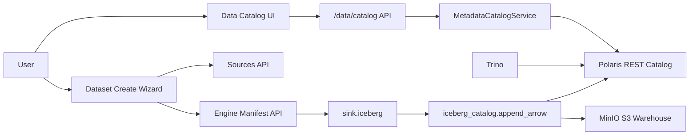

# Catalog Self-Service Plan

## Current State

- The data fabric services are healthy through AQP service-manager: Trino, Polaris, Iceberg, MinIO, Dask, and Ray report `ok=true`.
- The active catalog is **Polaris-backed Iceberg REST** at `http://polaris:8181/api/catalog`; `aqp-iceberg-rest` is legacy/stopped.
- Ingestion defaults are already Iceberg-oriented at the backend level:
  - [`aqp/api/routes/data_pipelines.py`](c:/Users/Julian%20Wiley/Documents/GitHub/agentic_quant_platform/aqp/api/routes/data_pipelines.py) exposes `/pipelines/ingest` as local file/folder/ZIP -> Iceberg via `ingest_local_path`.
  - [`aqp/data/fetchers/sinks/__init__.py`](c:/Users/Julian%20Wiley/Documents/GitHub/agentic_quant_platform/aqp/data/fetchers/sinks/__init__.py) lists `sink.iceberg` first with default node template `{ name: "sink.iceberg", kwargs: {} }`.
  - [`aqp/data/fetchers/sinks/iceberg_sink.py`](c:/Users/Julian%20Wiley/Documents/GitHub/agentic_quant_platform/aqp/data/fetchers/sinks/iceberg_sink.py) writes through `iceberg_catalog.append_arrow`.
- Main mismatch: the new frontend uses `/data/catalog/*` and `/data/symbols/*`, while current backend endpoints are split between `/metadata/catalog/*`, `/data/{vt_symbol}/bars`, `/data/securities/{vt_symbol}/coverage`, and direct Iceberg helpers. This causes catalog/browser pages to look disconnected despite the fabric being healthy.

## Implementation Scope

### 1. Backend compatibility and catalog API

Add a new backend router or extend [`aqp/api/routes/data.py`](c:/Users/Julian%20Wiley/Documents/GitHub/agentic_quant_platform/aqp/api/routes/data.py) with compatibility endpoints consumed by the Vite frontend:

- `GET /data/catalog/namespaces`
  - Return namespace summaries from `iceberg_catalog.list_namespaces()` + table counts.
  - Derive medallion layer from namespace prefixes (`aqp_bronze_*`, `aqp_silver_*`, `aqp_gold_*`) where possible.
- `GET /data/catalog/{namespace}`
  - Return table summaries for a namespace using `iceberg_catalog.list_tables(namespace)` plus metadata merge from `MetadataCatalogService` where available.
- `GET /data/catalog/{namespace}/{name}`
  - Return table detail: schema fields, partitions, row count, medallion layer, business metadata, data contract, latest snapshot time.
- `GET /data/catalog/{namespace}/{name}/snapshots`
  - Return Iceberg snapshot history.
- `GET /data/catalog/{namespace}/{name}/sample?limit=100`
  - Use DuckDB/Trino/Iceberg read path to return sample rows.
- `POST /data/catalog/{namespace}/{name}/query`
  - Optional table-scoped SQL runner for catalog detail tab.

Implementation preference:
- Reuse [`aqp/services/metadata_catalog_service.py`](c:/Users/Julian%20Wiley/Documents/GitHub/agentic_quant_platform/aqp/services/metadata_catalog_service.py) for catalog/lineage metadata.
- Reuse [`aqp/data/iceberg_catalog.py`](c:/Users/Julian%20Wiley/Documents/GitHub/agentic_quant_platform/aqp/data/iceberg_catalog.py) for all Iceberg operations; do not call PyIceberg directly outside the wrapper.

### 2. Backend symbol/browser API

Add frontend-compatible symbol browser endpoints:

- `GET /data/symbols/{vt_symbol}`
  - Return instrument metadata from `Instrument`/catalog rows or config fallback.
- `GET /data/symbols/{vt_symbol}/bars`
  - Delegate to existing `/data/{vt_symbol}/bars` logic or shared helper.
- `GET /data/symbols/{vt_symbol}/stats`
  - Delegate to existing `/data/{vt_symbol}/stats`.
- `GET /data/symbols/{vt_symbol}/coverage`
  - Delegate to existing `/data/securities/{vt_symbol}/coverage`.
- `GET /data/symbols/{vt_symbol}/fundamentals` and `/news`
  - Return empty but well-shaped payloads if no data exists; avoid 404s in the UI.

Also fix the detached SQLAlchemy instance bug observed in `/data/universe?source=catalog` by materializing `Instrument` fields inside the active session in `_list_catalog_universe`.

### 3. Dataset metadata detail/edit backend

Use existing [`aqp/api/routes/metadata_catalog.py`](c:/Users/Julian%20Wiley/Documents/GitHub/agentic_quant_platform/aqp/api/routes/metadata_catalog.py):

- `GET /metadata/catalog/datasets`
- `GET /metadata/catalog/datasets/{dataset_id}`
- `PATCH /metadata/catalog/datasets/{dataset_id}`
- `GET /metadata/catalog/datasets/{dataset_id}/lineage`

Add only if missing:
- `POST /metadata/catalog/datasets`
  - Create/register a dataset metadata record before ingestion.
  - Fields: `name`, `provider`, `domain`, `namespace`, `table`, `description`, `tags`, `source_uri`, `load_mode`.
- `POST /metadata/catalog/datasets/{dataset_id}/ingest`
  - Convenience endpoint that dispatches `ingest_local_path` or `engine.runManifest` depending on dataset source config.

### 4. Self-service source-to-Iceberg ingestion backend

Expose a narrow self-service creation flow using existing source and sink infrastructure:

- `GET /sources` and `/sources/{name}/probe` already exist; keep them.
- Add or wire a `POST /sources/{name}/datasets` endpoint if absent:
  - Accept source name, dataset slug, namespace/table, source-specific kwargs, schedule optional.
  - Construct a `PipelineManifest` with:
    - `source`: configured source node
    - `transforms`: optional defaults
    - `sink`: `sink.iceberg`
    - `compute`: `auto`
  - Save through engine manifest registry and return manifest id.
- Ensure dense files/API pulls default to Iceberg namespace/table, not Parquet.

### 5. Frontend data catalog detail/edit UI

Update the current catalog pages:

- [`frontend/src/routes/data/catalog/page.tsx`](c:/Users/Julian%20Wiley/Documents/GitHub/agentic_quant_platform/frontend/src/routes/data/catalog/page.tsx)
  - Add search/filter across namespace/table.
  - Add health banner showing Polaris/Trino/MinIO status from `/service-manager/health`.
  - Add "New Dataset" button opening a self-service wizard.
- [`frontend/src/routes/data/catalog/[namespace]/[name]/page.tsx`](c:/Users/Julian%20Wiley/Documents/GitHub/agentic_quant_platform/frontend/src/routes/data/catalog/[namespace]/[name]/page.tsx)
  - Add edit drawer for business metadata, description, tags, medallion layer, data contract JSON.
  - Add tabs: Overview, Schema, Partitions, Snapshots, Sample, Lineage, Entities, SQL Query, Edit History.
  - Wire metadata save to `PATCH /metadata/catalog/datasets/{dataset_id}` when table maps to a registered dataset.
  - If Iceberg-only table has no registered dataset, offer "Register metadata" action.
- Add a route for `frontend/src/routes/data/catalog/dataset/[dataset_id]/page.tsx` if not already present in new frontend:
  - Use metadata catalog detail + lineage endpoint.

### 6. Frontend data browser connection

Update:

- [`frontend/src/components/data/DataBrowserHome.tsx`](c:/Users/Julian%20Wiley/Documents/GitHub/agentic_quant_platform/frontend/src/components/data/DataBrowserHome.tsx)
  - Default source should be `catalog` or `managed_snapshot`, not `lake`, because the active fabric is Iceberg/Polaris.
  - Add fabric health/status badge.
- [`frontend/src/components/data/DataSymbolBrowser.tsx`](c:/Users/Julian%20Wiley/Documents/GitHub/agentic_quant_platform/frontend/src/components/data/DataSymbolBrowser.tsx)
  - Use new `/data/symbols/*` endpoints.
  - Add tabs: Bars, Stats/Gaps, Coverage, Fundamentals, News, Catalog Links.
  - Gracefully show empty states instead of raw `{}`/`[]` dumps.

### 7. Frontend self-service dataset creation

Add reusable components under `frontend/src/components/data/`:

- `DatasetCreateWizard.tsx`
  - Step 1: choose source from `/sources`.
  - Step 2: probe source / show capabilities.
  - Step 3: dataset metadata: name, namespace, table, medallion layer, description, tags.
  - Step 4: source config JSON (CodeEditor).
  - Step 5: sink preview: `sink.iceberg`, Polaris catalog, MinIO warehouse path.
  - Step 6: create manifest / optionally run now.
- `DatasetMetadataDrawer.tsx`
  - Edit dataset description/tags/load mode/business metadata/data contract.
- `DatasetLineagePanel.tsx`
  - Render lineage nodes/edges from metadata catalog endpoint.

### 8. Validation

Run after implementation:

- Service/fabric:
  - `GET /service-manager/health` -> `ok=true` for Trino, Polaris, Iceberg, MinIO, Dask, Ray.
  - `POST /service-manager/trino/verify` -> `query_ok=true`, `iceberg_catalog_ok=true`.
  - `GET /service-manager/iceberg/status` -> `error=null`.
- Catalog API:
  - `GET /data/catalog/namespaces` returns at least `quickstart_catalog` namespaces if tables exist, or empty with `200`.
  - `GET /data/catalog/{namespace}` and detail endpoints return `200` for any discovered table.
- Browser API:
  - `GET /data/universe?source=catalog` no longer throws `DetachedInstanceError`.
  - `/data/symbols/{vt_symbol}` endpoints return `200` or structured empty payloads.
- UI:
  - Visit `/data/catalog`, `/data/catalog/{namespace}/{name}`, `/data/browser`, `/data/browser/{vt_symbol}`, `/data/sources`.
  - No React page errors.
  - Create dataset wizard can produce an engine manifest with `sink.iceberg`.
- Tests:
  - Add focused unit tests for catalog API wrappers and dataset wizard validation.
  - Run `pnpm typecheck`, backend import/route smoke, and targeted pytest for new route helpers.

## Flow

## Non-goals

- Do not remove/reset MinIO data.
- Do not revive `aqp-iceberg-rest`; keep it legacy/stopped.
- Do not replace Polaris with SQL catalog fallback.