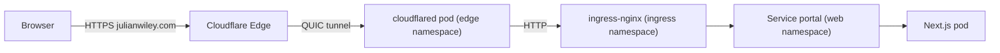

# cloudflared — Cloudflare Tunnel

Outbound-only tunnel daemon that exposes selected in-cluster services to the
public internet via Cloudflare's edge. The tunnel terminates TLS at
Cloudflare and forwards plain HTTP to the cluster's `ingress-nginx`
controller, which then dispatches by `Host` header to the right Service.



## Layout

| File              | Purpose                                                       |
| ----------------- | ------------------------------------------------------------- |
| `configmap.yaml`  | `config.yaml` with `ingress:` map of `host -> in-cluster URL` |
| `secret.yaml`     | Tunnel credentials JSON (PLACEHOLDER — replace before applying) |
| `deployment.yaml` | 2 replicas, read-only rootfs, multi-arch                      |
| `service.yaml`    | Headless ClusterIP for Prometheus to scrape `/metrics`        |

## First-time setup

You need a Cloudflare account that owns `julianwiley.com` and the
`cloudflared` CLI installed locally.

```bash
# 1. Authenticate the CLI against the Cloudflare account
cloudflared tunnel login

# 2. Create a named tunnel — the name MUST match `tunnel:` in configmap.yaml
cloudflared tunnel create julianwiley-portal
#    -> writes ~/.cloudflared/<tunnel-id>.json

# 3. Route the apex + www to the tunnel (creates Cloudflare-managed CNAMEs)
cloudflared tunnel route dns julianwiley-portal julianwiley.com
cloudflared tunnel route dns julianwiley-portal www.julianwiley.com

# 4. Inject the credentials JSON into the cluster Secret
kubectl -n edge create secret generic cloudflared-credentials \
  --from-file=credentials.json=$HOME/.cloudflared/<tunnel-id>.json \
  --dry-run=client -o yaml | kubectl apply -f -

# 5. Apply the manifests (or rely on the root kustomization)
kubectl apply -k kubernetes/base-services/cloudflared/

# 6. Restart in case Step 5 used the placeholder Secret
kubectl -n edge rollout restart deploy/cloudflared
kubectl -n edge logs -l app=cloudflared --tail=50
```

A healthy startup log ends with lines like:

```
Registered tunnel connection ... connIndex=0 ...
Registered tunnel connection ... connIndex=1 ...
Updated to new configuration config_version=...
```

## Adding a new public hostname

1. CNAME the new hostname in Cloudflare DNS:
   ```bash
   cloudflared tunnel route dns julianwiley-portal <new-hostname>
   ```
2. Add an entry in [`configmap.yaml`](configmap.yaml) above the catch-all
   `http_status:404` rule.
3. Make sure the in-cluster `Ingress` accepts the new `Host` header.
4. Apply and restart:
   ```bash
   kubectl apply -k kubernetes/base-services/cloudflared/
   kubectl -n edge rollout restart deploy/cloudflared
   ```

## Why not MetalLB + cert-manager + port-forward

Both work, but the tunnel pattern:

- **needs zero inbound port-forwards** on the home router,
- gives free DDoS / WAF protection at Cloudflare's edge,
- terminates TLS at Cloudflare so cert-manager / Let's Encrypt isn't required,
- uses the same outbound dial-out pattern as the existing `tailscale` /
  GitHub Actions runners, which is the only egress path many homelab ISPs
  reliably support.

The trade-off is that all public traffic flows through Cloudflare; for any
service that should stay LAN-only, simply omit it from `configmap.yaml`.

## Observability

The Prometheus scrape target is exposed at `cloudflared-metrics.edge:2000`.
Add a `ServiceMonitor` (or scrape job) under
[`kubernetes/observability/prometheus/values.yaml`](../../observability/prometheus/values.yaml)
when the cluster's Prometheus is fully wired up.
